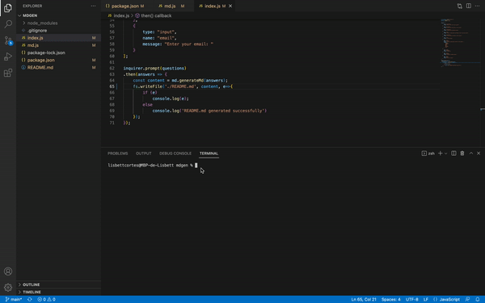

# Professional README generator

## Description
Simple node.js application to automatically generate a project README.md from a series of questions to the author.

## Table of Contents
- [Installation](#installation)
- [Usage](#usage)
- [License](#license)
- [Contributing](#contributing)
- [Tests](#tests)
- [Questions](#questions)

## Installation
`npm install` to install all dependencies

## Usage

From the terminal type `node index.js` to start the application. Then answer a series of questions about the project.
A full length, 1080p recording of the walk-through can be found [here](https://youtu.be/LDd4BZi33d4)

## License

This application is covered under ISC license.

## Contributing
This is a public project. Everyone is invited to contribute to it. See the questions section for contact information.

## Tests
No unit or integration tests were written.

## Questions
You can open issues on Github or directly contact the author.

Contact Information

[ lcortes0801](http://github.com/lcortes0801) on Github 

[:email: lcortes0801@gmail.com](mailto:lcortes0801@gmail.com)

  

Made with [Markdown Generator](https://github.com/lcortes0801/mdgen)
